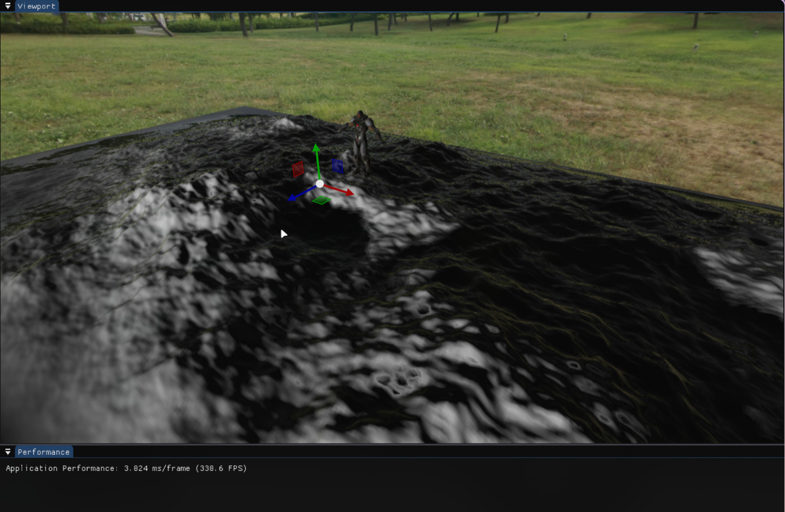
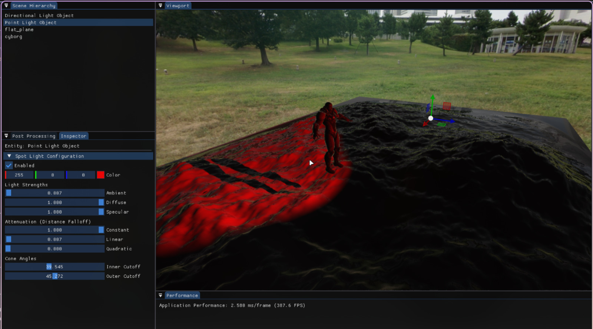
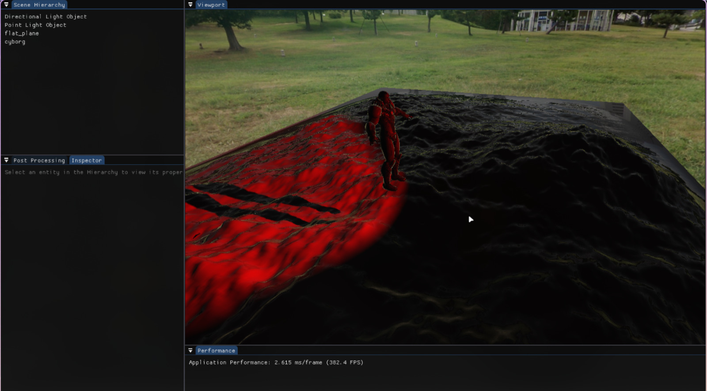
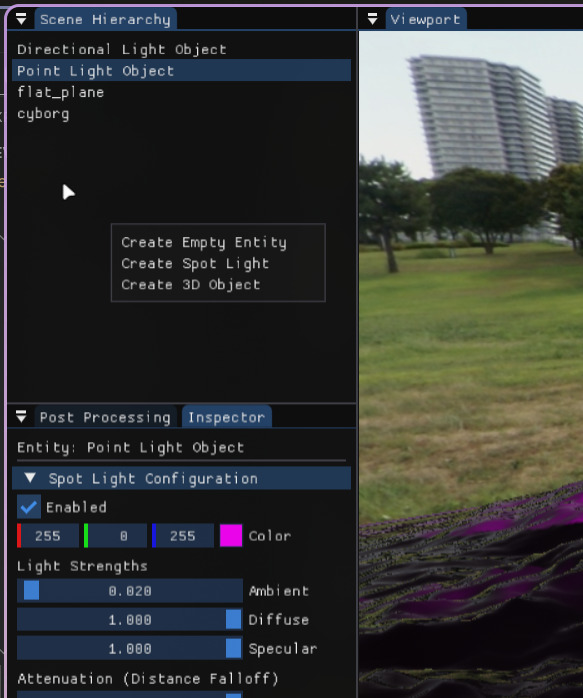
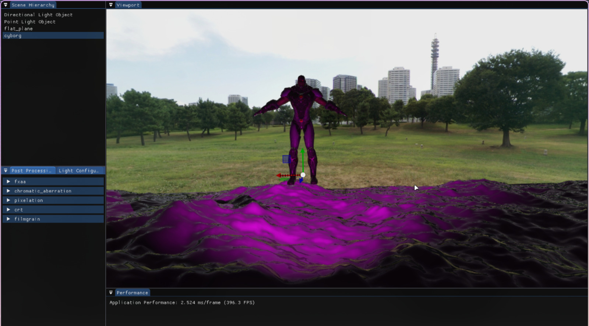
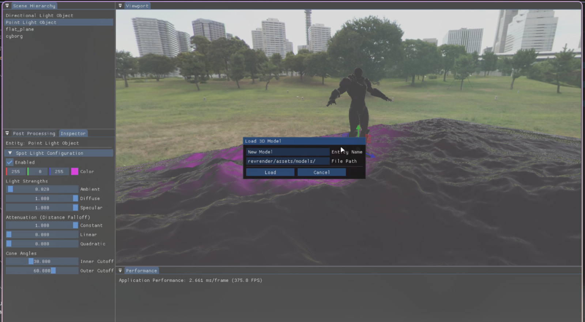
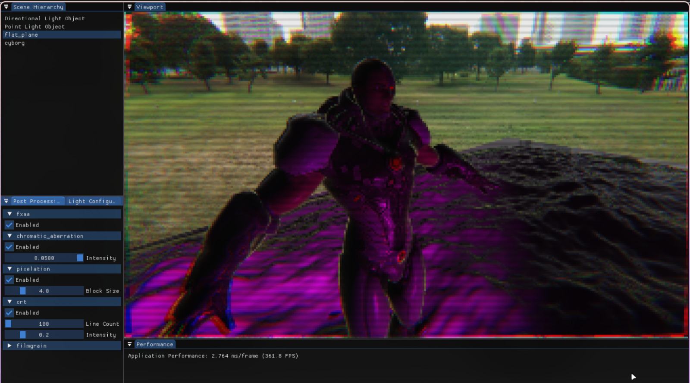
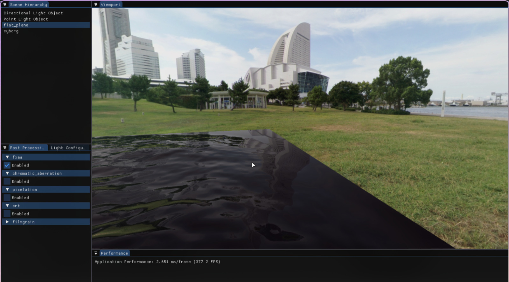

# REV RENDER ENGINE
This is the 5th rewrite. Why? Because the last one was very inefficient. (And I kinda don't remember what I was doing in the alst one a few months ago when I decided to leave it cause I was too busy with exams and stuff.)
And the last one didn't really use vcs. Was being developed on my machine locally and occasionally being updated on github but not nearly as much as it should have been.

## DEMONSTRATIONS
#### Directional Shadows

#### Spot Light Selected Inspector

#### Nothing Selected Inspector

#### Right Click Menu

#### FXAA Off

#### FXAA On

#### 3D Object Creation Menu

#### Postprocessing

#### Cubemap Reflections

